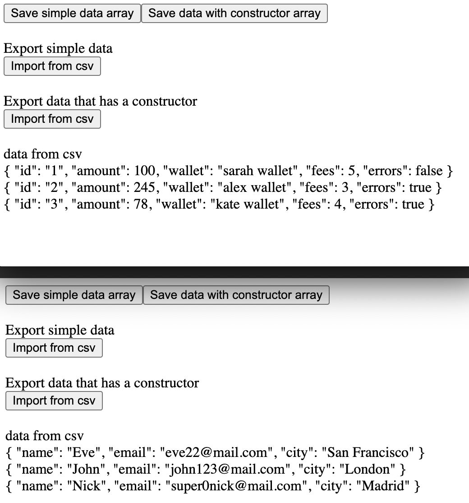

# Import export data in csv

Import export object where all properties has string type, also has algorithm that work with different types (like boolean, number etc)

https://www.youtube.com/watch?v=C2Fuj0gRRHI
